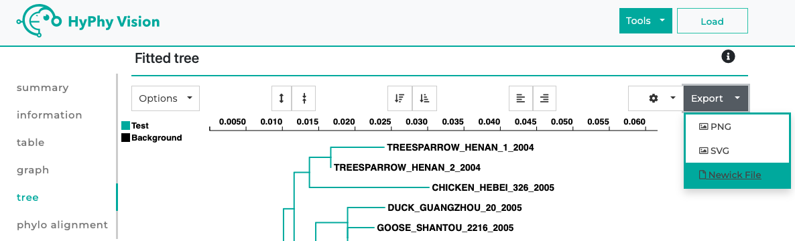

<!-- ## Dependency Installation: Newick Module -->

The program relies on the `newick` module to handle Newick tree data. Install it using:

```
pip install newick
```

---

## Data Format

### Input Files

The program requires:
1. **Fasta Files**: Ensure no stop codons are present in amino acid FASTA files.
2. **Newick Tree**: Follow the standard Newick format (e.g., those generated by FastTree).

Use FastTree in protein mode by providing an aligned amino acid FASTA file and running the tool to generate the tree.

Example resource:
[FastTree on Galaxy](https://usegalaxy.org/?tool_id=toolshed.g2.bx.psu.edu/repos/iuc/fasttree/fasttree/2.1.10%2Bgalaxy1)

Ensure all FASTA files:
- Are aligned to the HXB2 reference.
- Use HXB2 numbering.
- Are width-formatted (one sequence per line).

Helpful tool: [Galaxy FASTA Width Formatter](https://usegalaxy.org/?tool_id=toolshed.g2.bx.psu.edu%2Frepos%2Fdevteam%2Ffasta_formatter%2Fcshl_fasta_formatter%2F1.0.1).

---

## Configuration

Control inputs via `config.py`.

---

## Running Pipeline Part 1

Script: `run_pipeline_part_1.py`

This script performs steps 1–4 from the modules folder:
- Converts a Newick file into smaller groups.
- Creates two FASTA files per group for SLAC file generation.

### Configurable Inputs

Define these in `config.py`:
- **Clade**: Identifier for associated files. Example: `B`.
- **max_group_size**: Maximum size of groups. Example: `150`.
- **min_group_size**: Minimum size of groups. Example: `80`.

### Input Files
- **input_newick**: Phylogenetic tree in Newick format. Example: `B_rooted_2535.NWK`
- **input_amino_acid**: Aligned amino acid sequences (HXB2 numbering). Example: `strip_CladeB_AminoAcid_HXBC2(2535).fa`
- **input_nucleotide**: Aligned nucleotide sequences (HXB2 numbering). Example: `strip_CladeB_Nucleotide_HXBC2(2535).fa`
- **Amino_Root_sequence_path**: Amino acid consensus sequence (HXB2 numbering). Example: `Con_amino_B_lin.fa`
- **nucleotide_Root_sequence_path**: Nucleotide consensus sequence (HXB2 numbering) consensus sequence name should match between Amino_Root_sequence_path and nucleotide_Root_sequence_path. Example: `Con_nuc_B_lin.fa`

### Outputs
- **Clade_B_amino_fastas**: Contains amino acid FASTA files for groups.
- **Clade_B_nucleotide_fastas_cleaned**: Contains nucleotide FASTA files for groups.

---

## Using Galaxy Workflow for SLAC

### Steps
1. [Create a Galaxy account](https://training.galaxyproject.org/training-material/faqs/galaxy/account_create.html).
2. Navigate to the **Workflow** tab.
3. Import `Galaxy-Workflow-Slac.ga`.
   
   

4. Run the workflow:
   - Add amino acid FASTA files from `Clade_B_amino_fastas`.
   - Add nucleotide FASTA files from `Clade_B_nucleotide_fastas_cleaned`.
   - Press the **Run Workflow** button.

   

5. Download SLAC files by clicking the save button.

   

6. Name files appropriately (e.g., `84.json`, `84.new`) and save them in `Clade_B_Slac_data`.
7. Upload SLAC files to [HyPhy Vision](http://vision.hyphy.org/SLAC#tree-tab) to retrieve JSON and Newick files.

   

---

## Counting Independent Mutations

Script: `Count_independent_mutation_Tree.py`

### Configurable Inputs
- **Clade**: Identifier for associated files. Example: `B`.
- **clade_consensus**: Path to the consensus sequence FASTA file.
- **Slac_data**: Path to the SLAC data folder containing JSON and Newick files. Example: `Clade_B_Slac_data`.

Ensure JSON and Newick files have matching names (e.g., `Group_84.nwk` and `Group_84.json`).

### Output
- **Clade_B_Count_independent_mutation.txt**: Lists all sites, groups, and frequencies of independent mutation events per amino acid.

---
