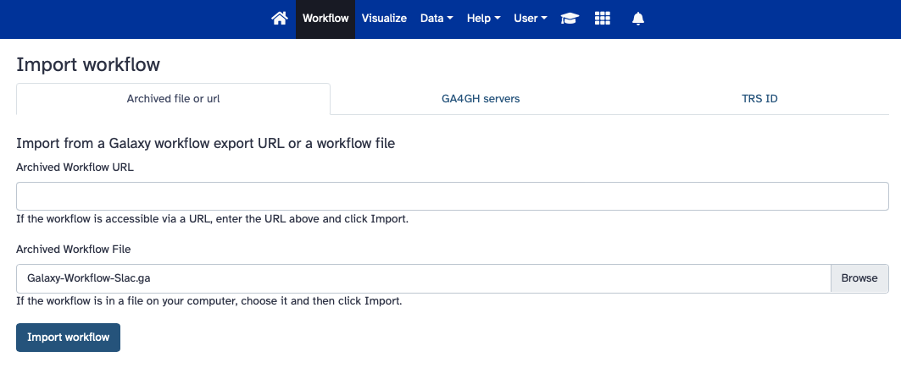
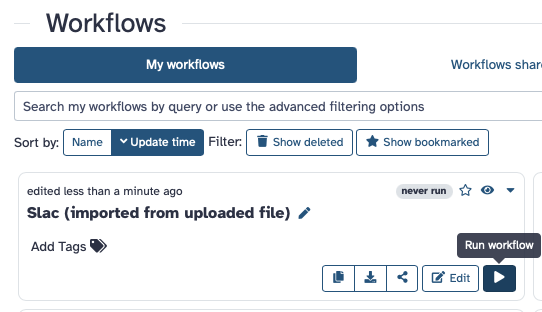
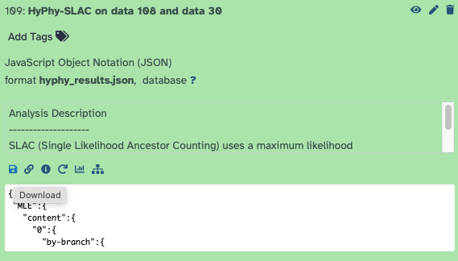
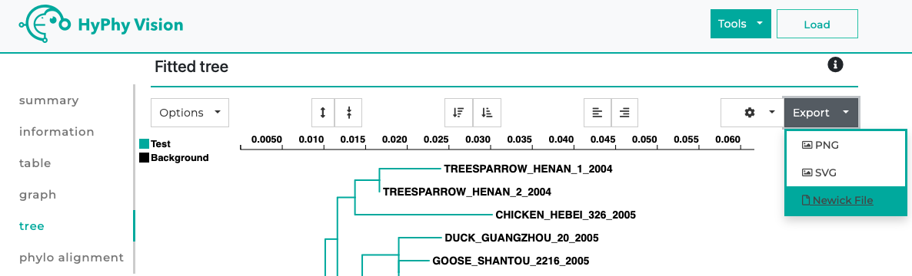

##  Installing the Dependency (newick module)
The program requires the newick module to handle Newick tree data. You can install this module using the following pip command:

    pip install newick

## Data format

The primary inputs for this program are Fasta files and a Newick tree.

Newick files should adhere to the standard Newick format, similar to those generated by FastTree.

All Fasta files must be aligned to the HXB2 reference and follow HXB2 numbering

## Run Pipline Part 1

*run_pipline_part_1.py*

This script runs step 1-4 from the modules folder.

It converts A Newick (.NWK) file into sepreate small groups then converts those groups into two fasta files that can be used to create a slac file.

### Inputs: 

**File_1:** A Newick (.NWK) file containing the full phylogenetic tree. 
Example: *B_rooted_2535.NWK*

**File_2:** A striped FASTA file containing the amino acid sequences for the tree must be provided. The sequences should be aligned and follow HXB2 numbering.
Example: *strip_CladeB_AminoAcid_HXBC2(2535).fa*

**File_3:** A Striped FASTA file with the nucleotide sequences for all taxa in the tree. The sequences should be aligned to and follow HXB2 numbering.
Example: *strip_CladeB_Nucleotide_HXBC2(2535).fa*

**File_4:** A FASTA file containing the amino acid consensus sequence for the clade using HXBC2 numbering.
Example: *Con_amino_B_lin.fa*

**File_5:** A FASTA file containing the nucleotide consensus sequence for the clade. 
Example: *Con_nuc_B_lin.fa*

## Galaxy-Workflow-Slac

    https://galaxyproject.org

First you will need to create a Galaxy account if you do not already have one.

    https://training.galaxyproject.org/training-material/faqs/galaxy/account_create.html

Once you are logged into your Galaxy account you will need to switch to the work flow tab.

Click on the **Workflow** tab on the top menu bar of Galaxy.

Click on the **Import** button just under and to the right of the top menu bar of Galaxy.

Click Browse and find **Galaxy-Workflow-Slac.ga** Upload the workflow to Galaxy.

Press the **run workflow** button on the bottom right.

For each group.

Add a fasta file from Clade_B_amino_fastas into Amino acid fasta.
Add a fasta file from Clade_B_nucleotide_fastas_cleaned to nucleic acid fasta.

Then Press the **run workflow** button on the top right.

Script: *Galaxy-Workflow-Slac.ga*

Download SLAC files: 

Press the floppy disc (save) button on the bottom left to download the slac jason file.

This jason file will need to be named with the group name and saved in Clade_B_Slac_data.

Upload this slac jason file to Hyphy Vison.

    http://vision.hyphy.org/SLAC#tree-tab

Upload the Slac file to the  HyPhy Viewer website and retrieve the JSON and Newick files associated with each SLAC file from the HyPhy Viewer website. 

Export the file as a jason from the HyPhy Vision website.

Insure that the name of the JSON and Newick files for each group whose names match and add all files to the file Clade_B_Slac_data.
(e.g., 84.json 84.new) 

## Count Independent Mutations 

run the following script: 
*Count_independent_mutation_Tree.py*

### Inputs: 

JSON and Newick files for each group match and add all files to the file Clade_B_Slac_data.

 